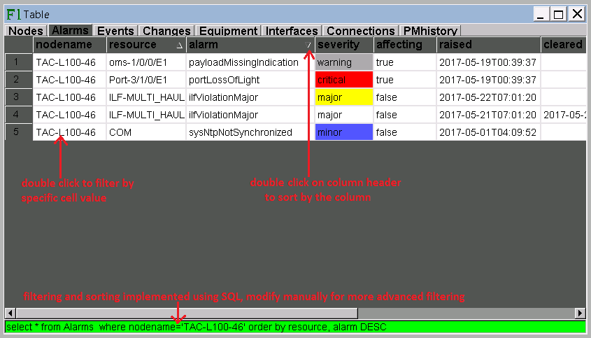
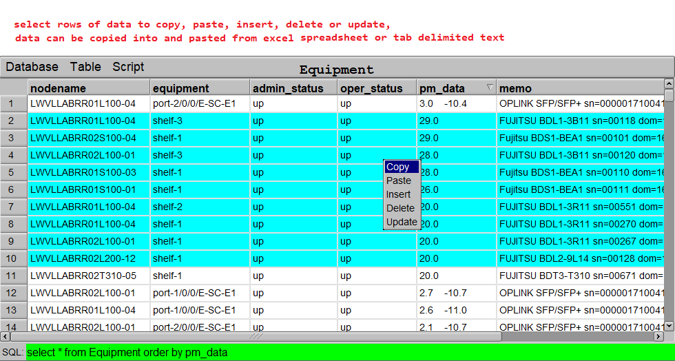
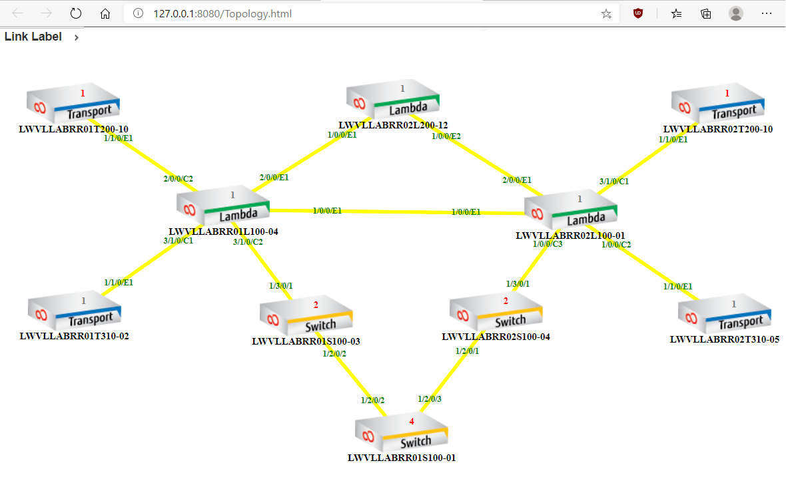
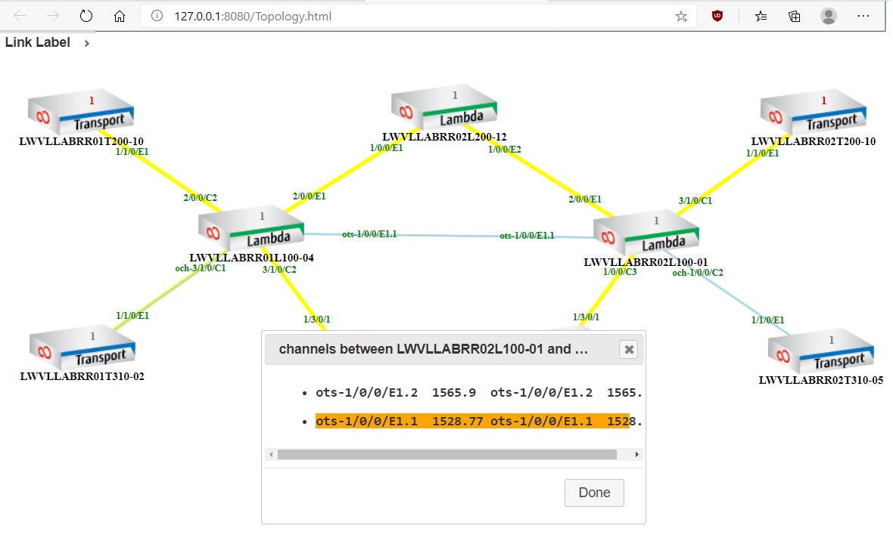

# flTable
FLTK based graphical front end for SQLite3, build to display and manipulate data for network monitoring and trouble shooting purpose, data is collected from network devices via netconf or telnet/ssh protocol by a separate utility, stored in sqlite3 database 

A build in http server allows data to be retrieved by any script using xmlxttp interface, Topology is an example using javascript, jquery and jsplumb to display network topology in any browser window

highlighting a end to end circuit through DWDM network 

